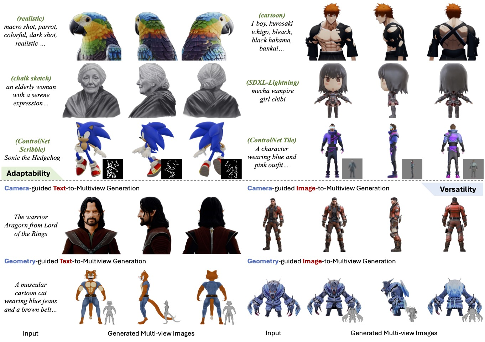
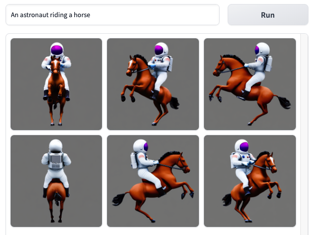
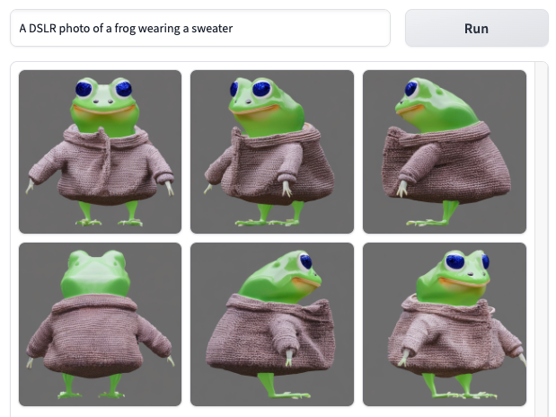
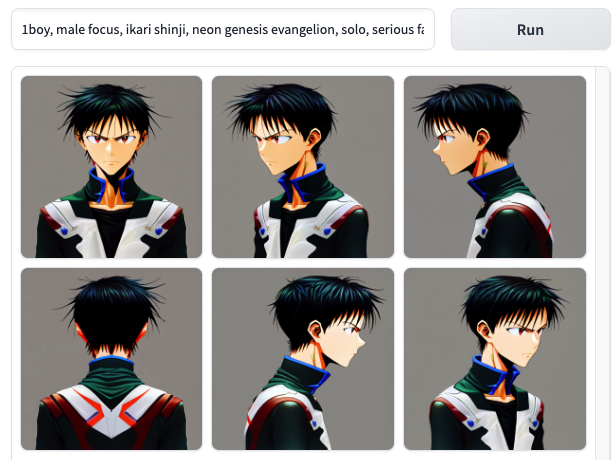
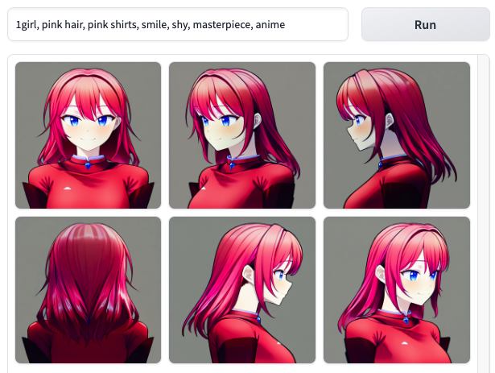
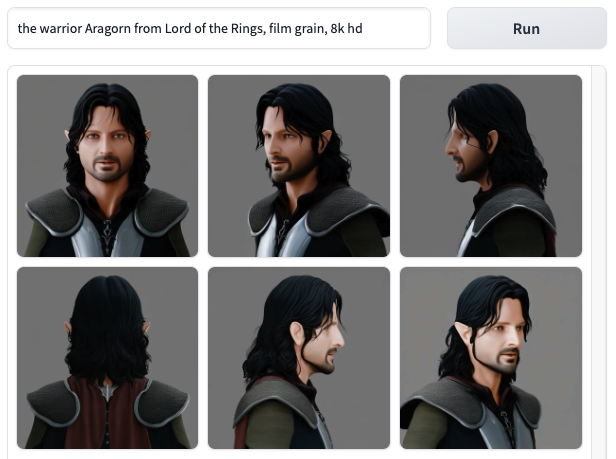
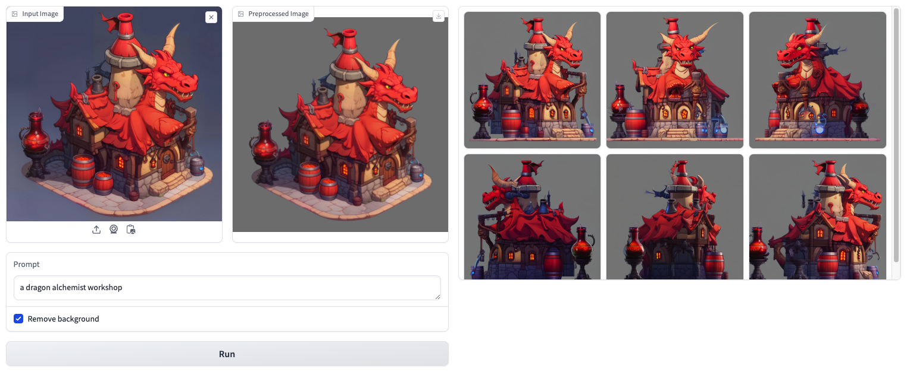
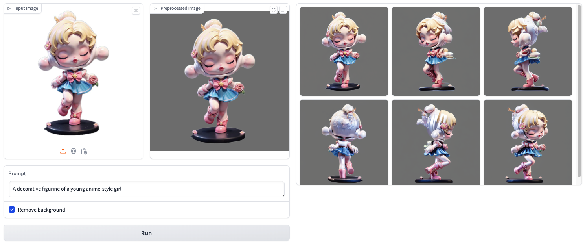

# MV-Adapter: Multi-view Consistent Image Generation Made Easy🚀

## 🏠 <a href="https://huanngzh.github.io/MV-Adapter-Page/" target="_blank">Project Page</a> | <a href="" target="_blank">Paper</a> | <a href="" target="_blank">Demo</a>



MV-Adapter is a **versatile plug-and-play adapter** that adapt T2I models and their derivatives to multi-view generators.

Highlight Features: Generate multi-view images

- with 768 Resolution using SDXL
- using personalized models (e.g. <a href="https://civitai.com/models/112902/dreamshaper-xl" target="_blank">DreamShaper</a>), distilled models (e.g. <a href="https://huggingface.co/docs/diffusers/api/pipelines/latent_consistency_models" target="_blank">LCM</a>), or extensions (e.g. <a href="https://github.com/lllyasviel/ControlNet" target="_blank">ControlNet</a>)
- from text or image condition
- can be guided by geometry for texture generation

## Model Zoo

No need to download manually. Running the scripts will download model weights automatically.

| Model | Base Model | HF weights |
| :-: | :-: | :-: |
| Text-to-Multiview | SDXL | [mvadapter_t2mv_sdxl.safetensors](https://huggingface.co/huanngzh/mv-adapter/resolve/main/mvadapter_t2mv_sdxl.safetensors) |
| Image-to-Multiview | SDXL | [mvadapter_i2mv_sdxl.safetensors](https://huggingface.co/huanngzh/mv-adapter/resolve/main/mvadapter_t2mv_sdxl.safetensors) |
| Text-Geometry-to-Multiview | SDXL |  |
| Image-Geometry-to-Multiview | SDXL |  |
| Image-to-Arbitrary-Views | SDXL |  |

## Installation

Clone the repo first:

```Bash
git clone https://github.com/huanngzh/MV-Adapter.git
cd MV-Adapter
```

(Optional) Create a fresh conda env:

```Bash
conda create -n mvadapter python=3.10
conda activate mvadapter
```

Install necessary packages (torch > 2):

```Bash
# pytorch (select correct CUDA version)
pip install torch torchvision --index-url https://download.pytorch.org/whl/cu118

# other dependencies
pip install -r requirements.txt
```

## Launch Demo

### Text to Multiview Generation

**With SDXL:**

```Bash
python -m scripts.gradio_demo_t2mv --base_model "stabilityai/stable-diffusion-xl-base-1.0"
```





> Reminder: When switching the demo to another base model, delete the `gradio_cached_examples` directory, otherwise it will affect the examples results of the next demo.

**With anime-themed <a href="https://huggingface.co/cagliostrolab/animagine-xl-3.1" target="_blank">Animagine XL 3.1</a>:**

```Bash
python -m scripts.gradio_demo_t2mv --base_model "cagliostrolab/animagine-xl-3.1"
```





**With general <a href="https://huggingface.co/Lykon/dreamshaper-xl-1-0" target="_blank">Dreamshaper</a>:**

```Bash
python -m scripts.gradio_demo_t2mv --base_model "Lykon/dreamshaper-xl-1-0" --scheduler ddpm
```



### Image to Multiview Generation

**With SDXL:**

```Bash
python -m scripts.gradio_demo_i2mv
```





## Inference Scripts

We recommend that experienced users check the files in the scripts directory to adjust the parameters appropriately to try the best "card drawing" results.

### Text to Multiview Generation

**With SDXL:**

```Bash
python -m scripts.inference_t2mv_sdxl --text "an astronaut riding a horse" \
--seed 42 \
--output output.png
```

**With personalized models:**

anime-themed <a href="https://huggingface.co/cagliostrolab/animagine-xl-3.1" target="_blank">Animagine XL 3.1</a>

```Bash
python -m scripts.inference_t2mv_sdxl --base_model "cagliostrolab/animagine-xl-3.1" \
--text "1girl, izayoi sakuya, touhou, solo, maid headdress, maid, apron, short sleeves, dress, closed mouth, white apron, serious face, upper body, masterpiece, best quality, very aesthetic, absurdres" \
--seed 0 \
--output output.png
```

general <a href="https://huggingface.co/Lykon/dreamshaper-xl-1-0" target="_blank">Dreamshaper</a>

```Bash
python -m scripts.inference_t2mv_sdxl --base_model "Lykon/dreamshaper-xl-1-0" \
--scheduler ddpm \
--text "the warrior Aragorn from Lord of the Rings, film grain, 8k hd" \
--seed 0 \
--output output.png
```

realistic <a href="https://huggingface.co/stablediffusionapi/real-dream-sdxl" target="_blank">real-dream-sdxl</a>

```Bash
python -m scripts.inference_t2mv_sdxl --base_model "stablediffusionapi/real-dream-sdxl" \
--scheduler ddpm \
--text "macro shot, parrot, colorful, dark shot, film grain, extremely detailed" \
--seed 42 \
--output output.png
```

**With <a href="https://huggingface.co/latent-consistency/lcm-sdxl" target="_blank">LCM</a>:**

```Bash
python -m scripts.inference_t2mv_sdxl --unet_model "latent-consistency/lcm-sdxl" \
--scheduler lcm \
--text "Samurai koala bear" \
--num_inference_steps 8 \
--seed 42 \
--output output.png
```

**With LoRA:**

stylized lora <a href="https://huggingface.co/goofyai/3d_render_style_xl" target="_blank">3d_render_style_xl</a>

```Bash
python -m scripts.inference_t2mv_sdxl --lora_model "goofyai/3d_render_style_xl/3d_render_style_xl.safetensors" \
--text "3d style, a fox with flowers around it" \
--seed 20 \
--lora_scale 1.0 \
--output output.png
```

**With ControlNet:**

Scribble to Multiview with <a href="https://huggingface.co/xinsir/controlnet-scribble-sdxl-1.0" target="_blank">controlnet-scribble-sdxl-1.0</a>

```Bash
python -m scripts.inference_scribble2mv_sdxl --text "A 3D model of Finn the Human from the animated television series Adventure Time. He is wearing his iconic blue shirt and green backpack and has a neutral expression on his face. He is standing in a relaxed pose with his left foot slightly forward and his right foot back. His arms are at his sides and his head is turned slightly to the right. The model is made up of simple shapes and has a stylized, cartoon-like appearance. It is textured to resemble the character's appearance in the show." \
--seed 0 \
--output output.png \
--guidance_scale 5.0 \
--controlnet_images "assets/demo/scribble2mv/color_0000.webp" "assets/demo/scribble2mv/color_0001.webp" "assets/demo/scribble2mv/color_0002.webp" "assets/demo/scribble2mv/color_0003.webp" "assets/demo/scribble2mv/color_0004.webp" "assets/demo/scribble2mv/color_0005.webp" \
--controlnet_conditioning_scale 0.7
```

### Image to Multiview Generation

**With SDXL:**

```Bash
python -m scripts.inference_i2mv_sdxl \
--image assets/demo/i2mv/A_decorative_figurine_of_a_young_anime-style_girl.png \
--text "A decorative figurine of a young anime-style girl" \
--seed 21 --output output.png --remove_bg
```

**With LCM:**

```Bash
python -m scripts.inference_i2mv_sdxl \
--unet_model "latent-consistency/lcm-sdxl" \
--scheduler lcm \
--image assets/demo/i2mv/A_juvenile_emperor_penguin_chick.png \
--text "A juvenile emperor penguin chick" \
--num_inference_steps 8 \
--seed 0 --output output.png --remove_bg
```

## ComfyUI

Please check <a href="https://github.com/huanngzh/ComfyUI-MVAdapter" target="_blank">ComfyUI-MVAdapter Repo</a> for details.

**Text to Multiview Generation**


**Image to Multiview Generation**


## Citation

```
@article{huang2024mvadapter,
  title={MV-Adapter: Multi-view Consistent Image Generation Made Easy},
  author={Huang, Zehuan and Guo, Yuanchen and Wang, Haoran and Yi, Ran and Ma, Lizhuang and Cao, Yan-Pei and Sheng, Lu},
  journal={},
  year={2024}
}
```
